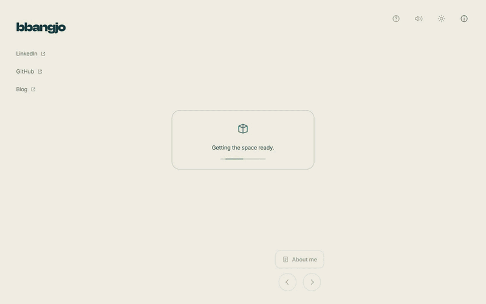

## Honor

This project is listed on the [portfolio-ideas](https://github.com/Evavic44/portfolio-ideas) repository.

## Description

Hello! This is my little corner of the internet, made with Three.js, TypeScript and Blender. I wanted a place that feels like meeting me: some music, some writing, a bit of travel, and something to play. Four isometric rooms open into low-poly meadows, with a robot nearby to show you around.

Sit at the piano, read a few stories, try the four-key rhythm game, or step outside to browse the pieces I have played and the places I have been. You can leave a message in the guestbook, too.

Visit [my rooms](https://bbangjo.kr), or head straight to [my blog](https://blog.bbangjo.kr). Thanks for stopping by!

Inspired by [Henry Heffernan](https://henryheffernan.com) and [Bruno Simon](https://github.com/brunosimon).

**Game music:** [Lasso Lady](https://opengameart.org/content/lasso-lady-seamless-loop) by congusbongus (CC0).

**Piano:** Salamander Grand Piano by Alexander Holm (CC BY 3.0). [Credits](https://bbangjo.kr/audio/piano/index.html).
