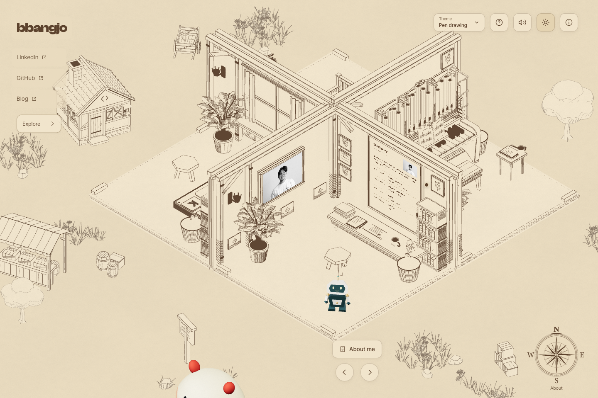
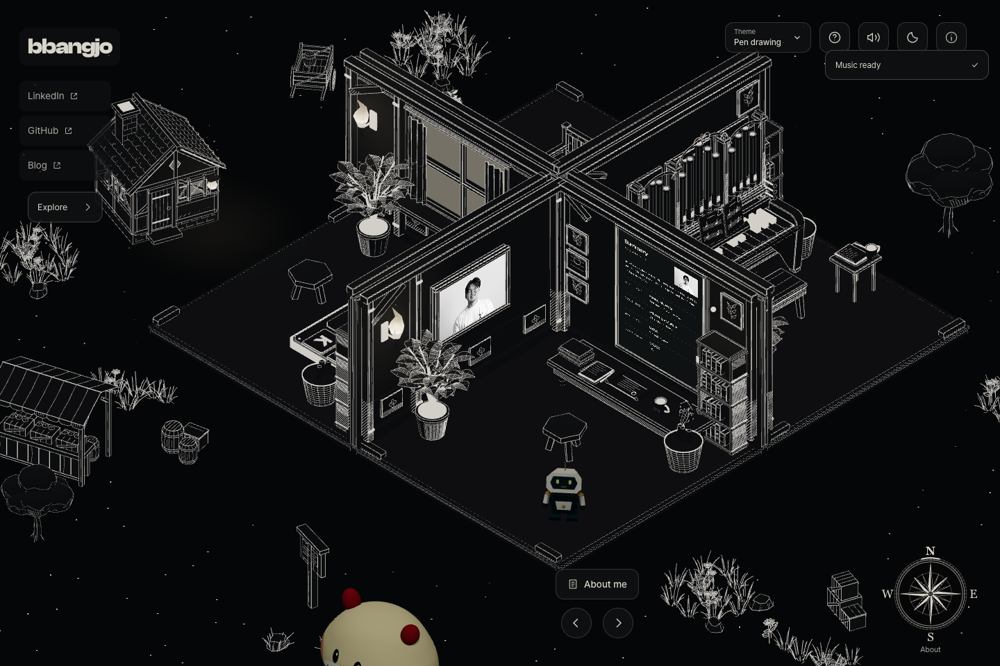
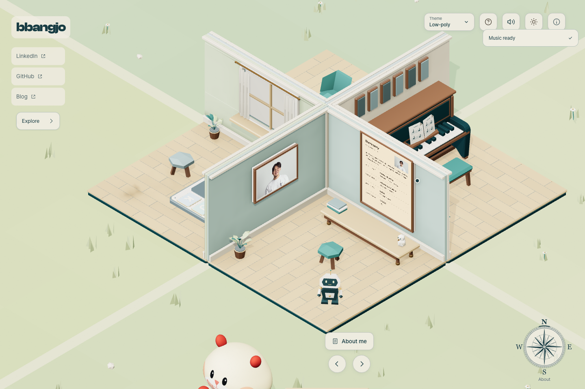
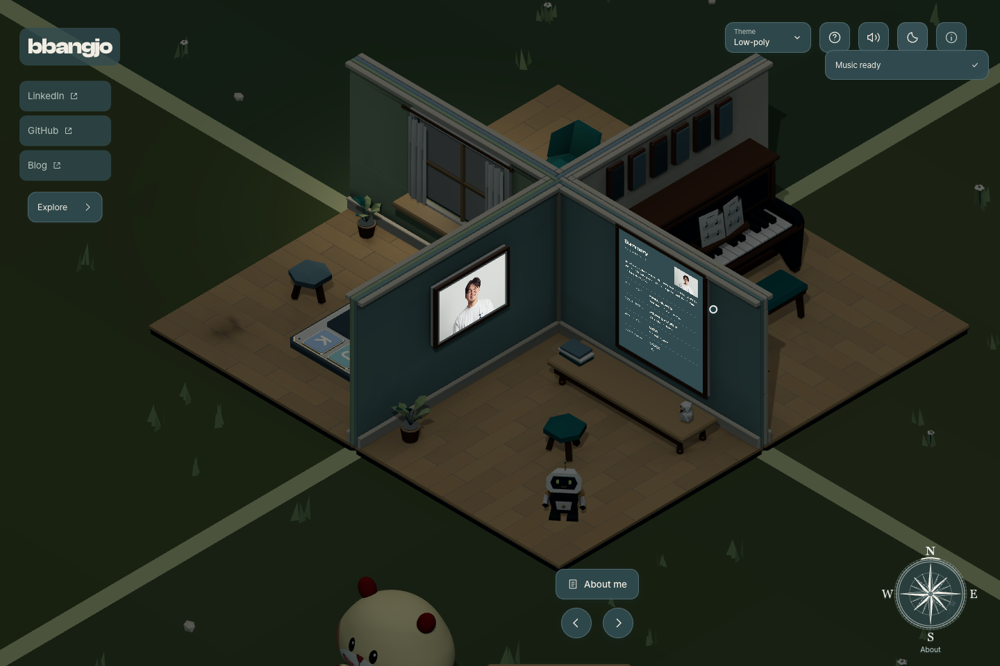
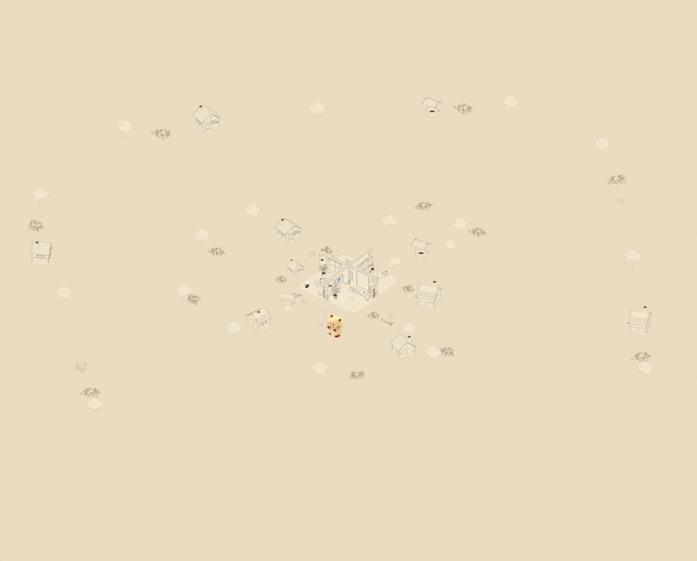
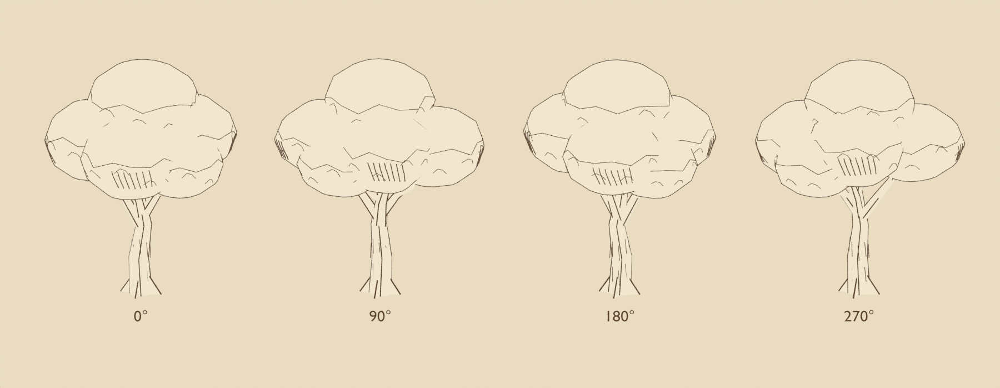

# 펜드로잉·Low-poly 테마 — 디자인 명세 v1.1.1

| 항목 | 발행 기준 |
| --- | --- |
| 문서 ID | `ATLAS-DESIGN-001` |
| 버전 / 발행일 | 1.1.1 / 2026-09-13 |
| 상태 | 발행 · 구현 반영 |
| 기준 구현 | [`93c1be8`](https://github.com/bbangjooo/buffalo/commit/93c1be80491f11024bc9e9b1320cca287e0a6e73) |
| 적용 PR | [#2 · 두 가지 테마와 확장된 마을](https://github.com/bbangjooo/buffalo/pull/2) |
| 적용 범위 | 네 방, 주변 마을·식재, 펜 재질, 낮·밤 표현, 화면 위 UI, Blender 검토 장면 |

이 문서는 구현된 디자인의 의도, 수치, 동작과 검수 기준을 함께 정의한다.
공간의 수량과 좌표는 v1.1 기준을 유지하며, v1.1.1에서는 Theme 메뉴의 상단 배치를 갱신했다.
후속 디자인에서는 구성과 수량을 바꿀 수 있으며,
관련 명세·배치 데이터·검토 화면·검증 결과를 같은 PR에서 갱신한다.

목차: [방향](#1-디자인-방향) · [검토 화면](#2-검토-화면) · [색상과 선](#3-색상재질펜선) ·
[공간과 에셋](#4-공간과-에셋) · [UI](#5-ui-규격) · [상태와 동작](#6-상태와-동작) ·
[제작과 전달](#7-제작과-전달) · [검수](#8-검수-기준) · [변경 관리](#9-변경-관리)

## 1. 디자인 방향

두 가지 아트 테마를 제공한다. **Pen drawing**은 현재의 브라운 지도·앤틱 물체,
**Low-poly**는 원본의 유색 방·피아노·초원이다. 기본값은 Pen drawing이며,
선택은 로컬에 저장된다. 낮/밤은 아트 테마와 별개의 축으로 유지하여 네 조합을 제공한다.


**“디테일한 네 방을 중심으로, 생활감 있는 마을이 넓은 종이 위에 이어진다.”**

물체에는 구조와 재질이 읽힐 만큼 선을 넣고, 물체 사이의 빈 공간은 시원하게 남긴다.
중앙 방의 주목도를 확보한 현재 구도 위에 집·정원·생활 소품을 바깥으로 확장한다.
배경의 풍성함은 여러 거리의 작은 군집으로 만든다.

| 원칙 | 적용 방식 |
| --- | --- |
| 중심 | 네 방을 하나의 가장 큰 공간 덩어리로 읽히게 한다. 가구와 콘텐츠 면을 식별할 수 있어야 한다. |
| 여백 | 바닥 전체를 풀·격자·해칭으로 채우지 않는다. 군집 사이와 주요 이동 통로를 연다. |
| 물체의 디테일 | 오르간 파이프, 가구 조각, 책등, 커튼 주름, 창틀, 지붕·목재 결에 묘사를 집중한다. |
| 마을의 깊이 | 가까운 소품, 중간 거리의 집, 먼 정원과 나무를 나누어 배치한다. |
| 시대적 외형 | 조명·가구·악기를 중세풍 또는 앤틱한 외형으로 표현한다. 방 안의 실제 글·음악·게임 내용은 유지한다. |
| 캐릭터 | 로봇과 햄스터는 고유 모델·재질을 유지한다. 주변 펜드로잉과 함께 존재하는 원래 동반자다. |
| 밤 | 검은 바탕과 은빛 선, 별, 작은 횃불·창의 밝기로 형태와 거리감을 만든다. |

사용자가 제공한 펜 스케치, 브라운 지도와 문장 그림, 검은 바탕의 밝은 선 그림을 해석한 방향이다.
최종 제작 기준은 이 명세와 아래의 자체 실행 화면이다.

## 2. 검토 화면

### Pen drawing의 실제 웹 기본 화면

| 낮 · 브라운 잉크와 종이 | 밤 · 검은 바탕과 은빛 선 |
| --- | --- |
|  |  |

### Low-poly의 실제 웹 기본 화면

| 낮 · 원본 유색 방과 초원 | 밤 · 원본 야간 팔레트 |
| --- | --- |
|  |  |

[320px 모바일 다크모드](../docs/media/atlas/mobile-night.png)에서도 제목·링크·상단 버튼과
우측 하단 나침반의 간격을 확인할 수 있다.

### 마을 전체 배치



위 이미지는 외곽까지 검토하는 **Blender 조감도**다. 웹의 기본 방 카메라와 구분한다.
[밤의 전체 배치](../docs/media/atlas/village-overview-night.png)와
[편집 가능한 Blender 파일](../assets/atlas-world.blend)을 함께 제공한다.

## 3. 색상·재질·펜선

### 3.1 Pen drawing 색상 토큰

CSS 값은 sRGB 표기다. 3D 재질은 선형 색 공간 변환과 표면 방향·국소 광원을 거치므로,
UI의 단일 HEX 값과 모든 3D 픽셀을 일치시키는 규격으로 해석하지 않는다.

| 역할 | 낮 | 밤 |
| --- | --- | --- |
| 배경 종이 / `--color-paper` | `#eadcc0` | `#050607` |
| UI 표면 / `--color-surface` | `#f2e6ce` | `#0e1011` |
| 기본 잉크·본문 / `--color-ink` | `#5c422d` | `#d8d4ca` |
| 보조 글자 / `--color-muted` | `#725b43` | `#aaa79e` |
| 호버 표면 / `--color-surface-hover` | `#e4d3b1` | `#1b1d1e` |
| 일반 경계 / `--color-border` | `#9a8060` | `#777970` |
| 버튼 표면 / `--control-surface` | `rgba(242,230,206,.88)` | `rgba(14,16,17,.86)` |
| 제목·링크 바탕 / `--control-label-surface` | `rgba(234,220,192,.76)` | `rgba(14,16,17,.76)` |
| 버튼 경계 / `--control-border` | `rgba(114,91,67,.28)` | `rgba(216,212,202,.18)` |

3D 낮 재질은 배경 `#eadcc0`, 물체의 종이 면 `#f2e6ce`, 잉크 `#5c422d`를 사용한다.
밤 재질은 검은 면과 은회색 선을 기본으로 표면 방향과 횃불 거리의 작은 차이를 더한다.
넓은 주황색·푸른색 조명 면이나 종이의 과한 그을음은 사용하지 않는다.

구현: [public/style.css](../public/style.css), [PenInk.ts](../src/Application/World/PenInk.ts),
[MedievalVillage.ts](../src/Application/World/MedievalVillage.ts).

Low-poly의 기본 잉크는 `#183c43`, 종이는 `#f1ede3`, 강조색은 `#3c7d7b`다.
야간 UI는 `#314b50` 표면·`#f1ede3` 글자를 사용한다. 원본 PBR 재질과 녹색 초원,
청록·오크·황동 팔레트를 복원하고 종이 결·사진 흑백 필터를 끈다.
정확한 토큰은 [원본 팔레트](../src/design/jo-colors.json)와
[조건부 UI 팔레트](../public/style.css)를 함께 따른다.

### 3.2 Pen drawing의 선과 종이

- 윤곽선, 재질 선, 해칭을 구분한다. 전체 면을 똑같은 밀도로 칠하지 않는다.
- 해칭은 물체의 면을 따라 붙는다. 나무·지붕·가구의 구조가 선보다 먼저 읽혀야 한다.
- 벽과 바닥은 가구보다 조용하게 표현한다. 문서·사진·건반을 가로지르는 장식을 넣지 않는다.
- 물체 윤곽과 세부 선은 Blender에서 작성한 지오메트리다. 웹에서 같은 물체의 외곽선을 중복 생성하지 않는다.
- 종이 결은 미세한 변화로 제한한다. 웹의 종이 오버레이 불투명도는 낮 `.075`, 밤 `0`이며 입력을 받지 않는다.
- 식재의 형태는 원본 템플릿을 복제해 사용하고, 선의 강도만 완화한다. 원본 템플릿의 좌표·색상 버퍼를 수정하지 않는다.

펜선 굵기는 화면 전체에 적용하는 고정 px가 아니라 물체 크기와 면에 맞춘 제작값이다.
실제 확대·축소 화면에서 윤곽과 세부 묘사를 구분할 수 있는지 검수한다.
제작 기준: [오르간](../scripts/pen_ink/room_atlas_organ.py),
[가구](../scripts/pen_ink/room_atlas_furniture.py), [마을 드로잉](../scripts/pen_ink/village_drawing.py).

## 4. 공간과 에셋

### 4.1 중앙 네 방

기본 시점의 고도는 **36°**다. 외곽 확장 시점부터 중앙 방의 카메라와 크기는 유지했다.
배경을 한 화면에 전부 넣기 위해 기본 방 카메라를 멀리 빼지 않는다.
화면 회전과 `Explore`로 주변 공간을 경험한다.

기존 low-poly 구도 대비 검증된 중심 물체의 가로 크기는 약 16–17%, 투영 면적은 약 31–41% 커졌다.
이는 [프레이밍 검증](../scripts/verify-atlas-framing.cjs)의 비교 결과이며, 모든 화면에서 같은 비율을 강제하는 CSS 규격은 아니다.

| 방 ID / 표시 이름 | 주요 물체·행동 | 보존할 콘텐츠 |
| --- | --- | --- |
| `developer` / About | 조각 프레임·게시판·책상, About me | 사진과 소개·이력 |
| `piano` / Piano | 소형 실내 오르간, 좌석·키보드·Listen | 원래 건반 입력과 연주·악보 |
| `blog` / Blog | 조각 게시판, Read the blog·Torch | 기존 블로그와 글 |
| `ai` / Play | 조각 게임 보드, Rhythm game·Leaderboard | 게임 규칙과 점수·리더보드 |

| 외형 치환 | 제작 기준 |
| --- | --- |
| 피아노 → 실내 파이프 오르간 | 21개 파이프와 조각 케이스. 원래 24개 3D 건반 `PianoKey60..83`, 악보·좌석·입력을 보존한다. 기존 피아노 음원 콘텐츠도 유지한다. |
| 현대 조명 → 횃불·앤틱 광원 외형 | 작은 불꽃과 주변 면의 국소 밝기. 전체 배경을 색 조명으로 덮지 않는다. |
| 모니터 케이스 → 조각 게시판·프레임 | 실제 화면 영역과 앵커를 보존한다. 장식이 문서·사진을 가리지 않는다. |
| 회전 의자 → 목제 의자 | 조각과 목재 구조를 표현하고 기존 사용 위치를 유지한다. |
| 책상·책·커튼·창 | 테두리, 책등, 주름과 창틀을 상세하게 묘사한다. 기존 이동과 커튼 동작을 유지한다. |

기준: [rooms.ts](../src/design/rooms.ts), [Camera.ts](../src/Application/Camera/Camera.ts),
[방 에셋 명세](../assets/pen-ink-rooms-manifest.json).

### 4.2 마을 배치

**현재 19개 요소 = 집 9채 + 생활 소품 10군집.** 좌표는 웹 월드의 X/Z, 단위는 프로젝트의 월드 단위다.
문서의 m 표기는 이 월드 배치를 설명하는 제작 단위다. 지면 Y는 `-0.16`이다.

| ID | 외형 | X | Z | 균일 배율 |
| --- | --- | ---: | ---: | ---: |
| scribe | 작은 너와풍 지붕 집 | -8.3 | 2.65 | 0.62 |
| weaver | 초가 지붕 집 | 12.6 | -4 | 1.00 |
| baker | 너와풍 지붕 집 | -15 | -4 | 0.90 |
| herbalist | 초가 지붕 집 | -4 | 17 | 0.88 |
| potter | 너와풍 지붕 집 | 18 | 9 | 0.92 |
| well | 우물 | 4 | -12.8 | 1.00 |
| market | 가판대 | -4 | 9.8 | 0.76 |
| cart | 수레 | -9 | -2.3 | 0.54 |
| notice | 게시판 | 3 | 9.7 | 0.90 |
| barrels | 나무통과 낮은 상자 군집 | -2.35 | 7.9 | 0.90 |
| crates | 쌓은 나무 상자 군집 | 10.5 | 2.6 | 0.90 |
| miller | 외곽 집 | -43 | -19 | 0.94 |
| beekeeper | 외곽 집 | 42 | -19 | 0.96 |
| woodcarver | 외곽 집 | -41 | 24 | 0.92 |
| orchard-keeper | 외곽 집 | 40 | 24 | 0.95 |
| hill-well | 외곽 우물 | -18 | -43 | 0.98 |
| orchard-market | 외곽 가판대 | 18 | 43 | 0.88 |
| woodland-cart | 외곽 수레 | -18 | 43 | 0.86 |
| riverside-barrels | 외곽 나무통 군집 | 19 | -43 | 1.05 |

첫 화면에서는 작은 집과 두 나무가 주변을 잡고, 수레·게시판·나무통·상자가 빈 가장자리에 보인다.
기존 11개 요소는 유지하고, 새 집과 생활 소품 8곳을 반경 약 40–50m의 외곽에 배치한다. 모든 외곽 물체가 기본 화면에 완전히 들어오는 것이 목표는 아니다.
가까운 수레처럼 독립적으로 읽혀야 하는 소품은 전체 윤곽을 확인한다.

회전·실제 충돌 반경·횃불 위치의 원본은 [마을 배치 JSON](../src/design/medieval-village-layout.json)이다.
배율 변경 후 충돌 반경과 광원 위치를 실제 지오메트리에서 다시 계산한다.

### 4.3 식재와 여백

| 종류 | 현재 수량 | v1.1 구현 예산 |
| --- | ---: | ---: |
| 풀 | 274 | 280 |
| 꽃 | 63 | 66 |
| 관목 | 35 | 36 |
| 나무 | 24 | 26 |
| 돌 | 20 | 22 |
| 합계 | 416 | 430 |
| 군집 | 21 | 21 |

종류별 여유를 동시에 모두 쓰는 예산이 아니다. 총량 430개와 종류별 제한을 함께 적용한다.
기존 220개 배치는 보존하고, 외곽 정원 8군집과 나무 12그루를 추가했다.
보수적인 식재 점유 범위는 약 **105.6×105.6m**이며, 배치된 나무 높이 제한은 **3.3m**다.

- 중앙 집 주변 여유: 집 반폭 5.6에 식재 여유 `.55`를 더하고 수관 반경까지 반영한다.
- 식재가 피하는 십자 통로 반폭: `1.25`.
- 기존 전시물 주변 거리: 일반 식재 `2.3`, 나무 `3.8`에 각각 식재 반경을 더한다.
- 출발점 여유: `.7`, 고체 물체와의 추가 여유: `.3`.
- 구조물은 별도의 통로 반폭 `1.05`와 실제 충돌 원을 사용한다. 기존 방문 위치와 글 읽는 시야도 보존한다.
- 식재는 다섯 종류의 고정 인스턴스 배치로 그린다. 이동 시 새 들판을 반복 생성하지 않는다.

기준: [식재 JSON](../src/design/atlas-landscape.json), [Meadow.ts](../src/Application/World/Meadow.ts).

### 4.4 입체 나무

기존 교차 종이면 수관을 **닫힌 수관 7개와 실제 입체 줄기·가지**로 교체했다.
앞뒤 수관이 겹치고, 하부와 겹침 부위의 곡면을 따라 평행 해칭이 붙는다.
가느다란 반전 외피는 윤곽만 그리며 전체 표면에 격자선을 두지 않는다.

| 템플릿 기준 | 최종 값 |
| --- | --- |
| 폭 / 깊이 / 높이 | 약 2.7405 / 2.9866 / 3.440m |
| 보수적 반경 | 2.0373m · 기존 2.1m 제한 이내 |
| 지오메트리 | 4,474 정점 / 5,746 삼각형 |
| 수관 | 닫힌 7개 체적, 각 수관의 열린 경계 0 |
| 웹 재질 | 단일 unlit vertex-color, FrontSide |
| Blender 검토 | Backfacing 투명 처리로 반전 외피의 앞면 가림 방지 |



Low-poly는 원본 초원 템플릿과 제한된 타일 풀을 복원한다.
Pen drawing의 마을·나무·식재는 해당 테마에서 표시되며 두 초원이 동시에 렌더링되거나
서로의 하늘·안개를 덮어쓰지 않는다.

## 5. UI 규격

### 5.1 타이포그래피

| 역할 | 폰트 우선순위 | 크기·무게·행간 |
| --- | --- | --- |
| 본문·일반 UI | Pretendard Variable | 기본 14px / 400 / 1.6 |
| 왼쪽 로고 | Clash Display → Wanted Sans Variable | 28px, 폭 1000px 이상 32px / 700 / 1.2, 자간 −.045em |
| 프로필 링크 | 본문 패밀리 | 12px, 폭 1000px 이상 14px |
| 정보 메뉴 링크 | 본문 패밀리 | 13px |
| 나침반 방위 문자 | Georgia → Times New Roman → serif | 17px, 폭 760px 이하 14px |
| 나침반 현재 방 | 본문 패밀리 | 11px, 폭 760px 이하 10px |
| 리듬·리더보드 패널 | Wanted Sans Variable 우선 | 각 패널 CSS의 역할별 크기 사용 |

위 폰트는 CSS의 우선순위다. 실제 사용 서체는 폰트 로딩 결과와 폴백을 따른다.
기준: [타입 토큰](../tokens.css), [폰트 로딩](../public/fonts/fonts.css).

### 5.2 제목·링크·컨트롤

UI는 원래의 타이포그래피 체계를 유지하고, 나침반 문자에는 지도와 어울리는 세리프를 사용한다.
배경판 바깥의 큰 그림자를 여백 대신 사용하지 않는다.

| 요소 | 실제 안쪽 여백 / 크기 | 배치 원칙 |
| --- | --- | --- |
| 왼쪽 제목 | 상하 8px, 좌우 12px | 낮·밤에서 위치와 크기 유지 |
| 프로필 링크 3개 | 상하 10px, 좌우 10px; 넓은 화면 좌우 12px | 링크 사이 6px, 각 링크 최소 높이 44px |
| 상단 아이콘 버튼 | 기본 44×44px | 화면 폭에 따른 버튼 사이 간격 적용 |
| 일반 방 행동 버튼 | 최소 높이 44px, 기본 상하 8px·좌우 14px; 40rem 이상 좌우 16px | 좌석·연주 같은 세부 버튼은 해당 컴포넌트의 보정값 적용 |
| 나침반 방향 버튼 | 32×32px | N/E/S/W와 접근 가능한 방 이름을 함께 제공 |
| 정보 메뉴 링크 | 최소 높이 44px, 상하 9px·좌우 12px | 현재 항목은 Credits |
| 모바일 Explore / 로딩 재시도 | Explore 최소 높이 38px; 재시도 기본 36px·모바일 40px | 각 보조 컴포넌트 규격 적용 |

위 크기는 요소별 실제 규격이다. 모든 버튼의 목표 크기가 동일하다는 의미는 아니다.
제목과 링크의 반투명 바탕은 물체를 넓게 덮는 사이드 패널로 합치지 않는다.

### 5.3 반응형 배치

아래 rem 분기의 px 환산은 기본 루트 크기 16px 기준이다.

| 조건 | 규격 |
| --- | --- |
| 폭 1000px 이상 | 왼쪽 제목과 세로 링크. 링크 열 너비 132px, 제목 다음 링크 영역의 위 간격 22px |
| 폭 1000px 미만 | 제목 아래 링크를 가로로 배치 |
| 폭 40rem 이상 | 헤더 여백 확대, 일반 방 행동 버튼 글자 14px·가로 여백 16px |
| 폭 90rem 이상 | 일반 방 헤더 가로 여백 48px·위 여백 32px |
| 나침반 기본 | 144×144px, 오른쪽 28px, 아래 32px를 기본값으로 안전 영역 반영 |
| 폭 760px 이하 | 나침반 104×104px, 오른쪽 14px, 아래 22px를 기본값으로 안전 영역 반영 |
| 폭 600px 이하 | 나침반이 이전/다음 방 버튼을 대신한다. 행동 버튼은 왼쪽, 나침반 공간은 오른쪽에 확보 |
| 폭 480px 이하의 기본 방 | 로고·Explore를 첫 줄, 우측 상단 컨트롤을 둘째 줄, 프로필 링크를 셋째 줄에 배치한다. 안전 영역이 없을 때 Explore는 위 20px·오른쪽 24px, 컨트롤은 위 68px·오른쪽 16px |
| 폭 380px 이하 | 나침반 88×88px·오른쪽 13px, 하단 조작부 오른쪽 여유 128px. 상단 버튼 36×40px·사이 간격 4px |

모바일에서 키보드는 필요할 때 펼친다. 글 읽기·연주 좌석·게임·야외 탐색은 각 상태의 조작부를 우선한다.
기준: [style.css](../public/style.css), [AtlasCompass.css](../src/Application/UI/components/AtlasCompass.css).

### 5.4 테마 선택

- `Theme` 메뉴의 두 선택지는 **Pen drawing / Low-poly**이며 `menuitemradio`로 현재 값을 표시한다.
- Theme는 우측 상단 `header-controls`의 첫 번째 컨트롤로, 단일 인스턴스를 사용한다. 도움말이 표시되는 기본 방에서는 도움말 바로 왼쪽에 둔다.
- 데스크톱 트리거는 124×44px이며 현재 테마 이름을 표시한다. 폭 760px 이하에서는 44×44px 아이콘 버튼, 380px 이하에서는 36×40px 아이콘 버튼으로 줄인다. 작은 화면에서도 접근 가능한 이름은 `Theme: 현재값`을 유지한다.
- Explore·연주 좌석에서도 동일한 상단 컨트롤을 사용한다. 읽기·리듬게임에서는 Theme를 숨기고 기존 전용 조작부를 유지한다. 넓은 Explore 화면의 컨트롤 간격은 8px, 폭 480px 이하에서는 4px이다.
- 로딩·방 이동·아트 테마 전환 중에는 선택을 막는다. 이미 선택된 항목은 다시 적용하지 않는다.
- 방향키·Home/End로 선택지를 이동하고 Escape·바깥 클릭·메뉴 밖 포커스로 닫는다.

다음 좌표는 안전 영역이 없는 실제 브라우저 검토값이며, 모든 뷰포트의 고정 좌표를 뜻하지 않는다.

| 검토 화면 | 배치 확인 |
| --- | --- |
| 1440px 기본 방 | Theme는 `(1044, 32)`의 124×44px, 도움말은 X=1180. 두 컨트롤 사이 12px |
| 320×740 기본 방 | Theme는 `(108, 68)`의 36×40px, 도움말은 X=148. 링크의 Y 범위는 약 121.6–165.6px, 로딩 알림은 Y=180px로 약 14.4px 간격 확보 |
| 320×740 연주 좌석 | Stand up은 Y=12–56px, 상단 컨트롤은 Y=64–104px. 키보드 안내는 약 Y=120–174.4px, 로딩 알림은 Y=198px로 약 23.6px 간격 유지 |
| 320×740 Explore | 왼쪽 복귀 버튼은 Y=12–54px, 위치 안내는 약 Y=62–93px. 오른쪽 상단 컨트롤은 Y=68–108px이며 서로 겹치지 않음 |

기준: [ArtThemeToggle](../src/Application/UI/components/ArtThemeToggle.tsx),
[테마 반응형 스타일](../src/Application/UI/components/ArtThemeToggle.css),
[상단 컨트롤 배치](../src/Application/UI/components/InterfaceUI.tsx).

## 6. 상태와 동작

### 6.1 화면별 역할

| 상태 | 표시·동작 기준 |
| --- | --- |
| 네 방의 기본 화면 | 프로필·방 행동 버튼·나침반으로 콘텐츠와 공간에 접근 |
| 방 이동 중 | 하단 조작부 불투명도 `.55`; 방 사물 행동 버튼과 나침반을 비활성화하고 완료 후 복원 |
| 문서·블로그·리더보드 읽기 | 프로필·나침반·일반 방 조작부를 숨기고 복귀 버튼을 표시한다. 배경 랜드마크가 읽는 면을 가리지 않도록 숨기고 복귀 시 복원 |
| 오르간 좌석 | 나침반을 숨기고 연주·키보드·일어나기 조작을 우선 |
| Explore | 원래 야외 전시와 콘텐츠를 표시한다. 걷기·목록·방으로 복귀를 제공하며 나침반을 숨긴다 |
| 리듬게임 | 게임 전용 화면과 조작을 사용하며 일반 나침반·헤더를 숨긴다 |

나침반의 `N/E/S/W`는 각각 **About/Piano/Blog/Play**로 이동한다.
실제 지리 방향을 나타내는 기능은 아니다. 현재 방은 `aria-current="page"`로 표시한다.
데스크톱 hover와 키보드 focus에서 방 이름을 보여주고, 작은 화면에서는 현재 방 표기와 접근 가능한 이름을 사용한다.

### 6.2 아트 테마 전환

`ink`와 `classic`을 전환할 때 장면은 200ms 동안 희미해지고, 중간 시점에 시각 메시만 교체한 뒤 다시 나타난다.
UI 팔레트는 400ms로 전환한다. 동작 줄이기 설정에서는 즉시 적용한다.
선택은 `bbangjo.art-theme`에 저장하며 잘못된 값·저장소 거부 시에도 기본 Pen drawing으로 정상 진입한다.

원본 모델의 시각 메시를 기존 기능 피벗에 한 번 연결하고 표시만 바꾼다.
현재 방·카메라·연주 위치·눌린 건반·커튼·문서 iframe·캐릭터를 다시 만들지 않는다.
원본 피아노와 조명에서는 행동 이름도 `Sit at the piano`·`Light`로 바뀐다.
사진은 원본 URL을 그대로 사용하고 CSS3D div의 배경에 그려 전환 후에도 표시를 유지한다.

Low-poly에서 숨긴 마을에는 보이지 않는 충돌을 남기지 않는다. Pen drawing으로 돌아올 때
방문자 위치에 건물이 생기면 가까운 안전한 위치로 조정한다.
낮/밤 상태는 아트 테마를 바꿔도 유지된다. 새로고침 시에는 저장된 아트 테마와 기존의 기본 낮 상태로 진입한다.

구현: [테마 상태](../src/design/art-themes.ts), [시각 메시 전환](../src/Application/World/ArtThemeMeshes.ts),
[원본 초원](../src/Application/World/ClassicMeadow.ts), [독립 검증](../scripts/verify-art-themes.cjs).

### 6.3 낮·밤과 전환

| 대상 | 구현값 / 동작 |
| --- | --- |
| 메인 컨트롤·나침반·보조 패널의 색·면·경계·글자 | 1100ms, `cubic-bezier(.65,0,.35,1)` |
| 독립 Summary iframe | 650ms, `ease` |
| 3D 펜 재질의 낮·밤 혼합 | 1.1초, GSAP `power2.inOut` |
| 해·달 아이콘 | 같은 위치의 두 아이콘이 불투명도로 교차 |
| 일반 버튼 피드백 | 불투명도 180ms, transform 140ms |
| 방 이동 중 하단 조작부 | 불투명도 240ms 전환, 이동 완료 후 1로 복원 |
| 새 방 행동 버튼·복귀 버튼 | 200ms 등장 |
| 오르간 건반·이동 키·리듬 입력과 판정 | 입력 반응에 테마 전환 지연을 적용하지 않음 |
| 동작 줄이기 | CSS 전환·등장 애니메이션을 끄고, 3D의 낮·밤 혼합도 즉시 반영 |

Pen drawing의 밤에는 현재 장면의 횃불 13개와 창의 작은 밝기, 별을 사용한다.
광원 등록 상한은 16개다. 장면 전체의 색을 주황색이나 푸른색으로 바꾸지 않는다.
메인 컨트롤과 3D는 같은 전환 길이를 사용해 화면의 테마가 함께 바뀌도록 한다.
Summary는 [별도 문서의 전환값](../public/story.html)을 사용하며, 외부 블로그 안의 UI는 해당 사이트의 동작을 따른다.

버튼·링크는 native 의미와 접근 가능한 이름을 유지한다. 다크모드 버튼은
`role="switch"`와 `aria-checked`를 사용하고, 키보드 포커스를 시각적으로 표시한다.
일반 포커스 링은 2px, 나침반은 1px이다. 읽기·착석 진입 시 복귀 버튼으로 포커스를
옮긴다. 종료 시 원래 트리거가 있으면 그곳으로, 없거나 보이지 않으면 대응하는 방 행동 버튼으로 복원한다.
정보 메뉴는 열 때 Credits에 포커스를 두고
Escape·바깥 클릭·Tab으로 닫는다.
확인 범위와 실제 실행 결과는 아래 검수표에 기록한다.

기준: [InterfaceUI.tsx](../src/Application/UI/components/InterfaceUI.tsx),
[AtlasCompass.tsx](../src/Application/UI/components/AtlasCompass.tsx),
[MedievalVillage.ts](../src/Application/World/MedievalVillage.ts).

## 7. 제작과 전달

| 산출물 | 경로 / 책임 |
| --- | --- |
| 원본 Low-poly 편집 파일 | [four-rooms.blend](../assets/four-rooms.blend), [courtyard.blend](../assets/courtyard.blend) |
| 중앙 방 편집 원본 | [pen-ink-rooms.blend](../assets/pen-ink-rooms.blend) |
| 식재·야외 원본 | [pen-ink-courtyard.blend](../assets/pen-ink-courtyard.blend) |
| 마을 편집 원본 | [medieval-village.blend](../assets/medieval-village.blend) |
| 통합 Day/Night 검토 | [atlas-world.blend](../assets/atlas-world.blend) |
| 웹 에셋 | [pen-ink-rooms.glb](../public/Room/pen-ink-rooms.glb), [pen-ink-courtyard.glb](../public/Room/pen-ink-courtyard.glb), [medieval-village.glb](../public/Room/medieval-village.glb) |
| 실제 검토 화면 | [docs/media/atlas](../docs/media/atlas/) |
| 수량·보존·검증 기록 | [atlas-composition-validation.json](../assets/atlas-composition-validation.json) |

마을 GLB는 **940,760 bytes**, **131,608 triangles**, **28개 mesh**다.
마을 구조물 예산은 최대 19개, 180,000 triangles다. 이 수치는 중앙 방·캐릭터·식재를 제외한 보조 마을 모델의 범위다.
Pen drawing 식재 416개는 고정 배치 5개를 사용한다. 원본 방·마당 GLB 두 개를 함께 로드해 첫 테마 전환 시 추가 다운로드를 기다리지 않는다.

Blender 기본 `VillageOverviewCamera`는 외곽 지오메트리 범위에 맞춘 조감도이며,
`RoomCompositionCamera`에는 가까운 방 구도를 보관한다. Blender의 정적 검토 화면과
브라우저의 HTML·음악·입력·애니메이션을 구분한다.

웹 실행은 Node 24 환경에서 다음 명령을 사용한다.

```sh
npm ci
npm run dev -- --host 127.0.0.1 --port 4178
```

에셋을 다시 제작할 때는 Blender 5.2.1에서 확인한 아래 순서를 사용한다.
`blender`는 설치한 Blender 실행 파일을 가리킨다.

```sh
blender --background --python scripts/build_pen_ink_courtyard.py
blender --background --python scripts/build_pen_ink_rooms.py
blender --background --python scripts/build_medieval_village.py
blender --background --python scripts/prepare_atlas_review.py
```

개별 재생성에서는 변경된 원본과 그에 의존하는 다음 단계만 다시 수행할 수 있다.
GLB·배치 JSON·충돌 반경·횃불 위치·manifest·통합 검토 파일이 같은 결과를 가리켜야 한다.
`assets/*.png`와 `assets/archive/`는 로컬 검토 산출물이며, PR용 이미지는 `docs/media/atlas/`에 저장한다.
음원 제작·출처·재생 상세는 별도의 [피아노 오디오 명세](piano-audio.md)를 따른다.

## 8. 검수 기준

| ID | 통과 기준 | 확인 방법 |
| --- | --- | --- |
| V-01 중심 구도 | 네 방이 가장 큰 공간으로 읽히고, 사진·문서·오르간 주요부가 잘리지 않는다 | 실제 낮·밤 화면, `verify-atlas-framing.cjs` |
| V-02 배경의 밀도 | 19개 마을 요소와 416개 식재가 선언된 위치에 나타나며, 가까운 소품과 먼 군집 사이에 여백이 남는다 | 전체 배치 이미지, JSON과 실제 GLB·인스턴스 비교 |
| V-03 이동·시야 | 원래 출발점과 전시 콘텐츠에 도달할 수 있고, 새 물체가 충돌 경계·읽기 시야를 침범하지 않는다 | `verify-medieval-village.cjs` |
| V-04 원본 보존 | 로봇·햄스터, 24개 건반, 화면·좌석 앵커와 원래 기능을 보존한다 | `verify-pen-ink.cjs`, 방 행동·연주 회귀 검사 |
| V-05 UI 배치 | 제목·링크·버튼에 실제 여백이 있으며, 모바일 하단 조작부와 나침반이 겹치지 않고 가로 넘침이 없다 | 1440×960, 390×844, 320×740 브라우저 확인 |
| V-06 상태 복원 | 네 방 이동·좌석 진입/복귀·Explore 진입/복귀 후 조작과 표시가 정상이며, 읽기 중 배경 가림이 없다 | 브라우저 조작, 리더보드/화면 생명주기 검사 |
| V-07 테마·입력 | 낮·밤에서 레이아웃이 유지되고, 입력 키는 즉시 반응하며 동작 줄이기가 반영된다 | 브라우저·야간 복원 검사, `verify-rhythm-game.cjs` |
| V-08 전달 일치 | 웹용 파일·Blender·배치 데이터가 일치하고 프로덕션 빌드가 성공한다 | manifest, `npm run build`, 파일·diff 검사 |
| V-09 테마 독립성 | 네 아트·낮/밤 조합, 선택 저장, 반복 전환 시 메시 증가 없음, 연주·키·문서 상태 보존 | `verify-art-themes.cjs`, 실제 브라우저·테마 검증 기록 |
| V-10 입체 나무 | 닫힌 수관의 앞뒤 겹침과 하부 해칭이 네 방향에서 읽히며 기존 크기·앵커를 보존한다 | 네 방향 이미지, Blender/GLB 경계·체적 검사 |

v1.1 기준 결과: 에셋 10개·Atlas 16개·프레이밍 19개 검사 통과.
확장된 19개 구조물의 충돌 접근 297회와 시야선 표본 234개를 확인했다. 새 테마 검사 9개도 통과했다.
세 화면 크기에서 가로 넘침·나침반 겹침·애플리케이션 콘솔 오류가 없었다.
실행 환경과 근거는 [검증 기록](../assets/atlas-composition-validation.json)에 보관한다.

오디오 검사 22개와 리듬게임·리더보드 검사는 동일 PR의 검증 기록을 함께 참조한다.
이번 버전의 실제 테마 전환·저장·연주 유지·모바일 검증은 [테마 검증 기록](../assets/art-theme-validation.json)에 보관한다.

## 9. 변경 관리

디자인 변경 PR에는 영향을 받는 명세 절, 구현·배치 데이터, 새 화면과 관련 검증 결과를 함께 포함한다.
색상·선·수량·카메라의 변경 의도와 실제 값을 구분해서 기록한다.
의도적으로 달라진 기준은 명세 버전과 변경 기록에 반영하고, 이전 스크린샷으로 새 상태를 설명하지 않는다.

| 버전 | 기준 구현 | 기록 |
| --- | --- | --- |
| 1.0 | `2af9eea` | 앤틱 펜드로잉, 확장된 마을 11개·식재 220개, 낮·밤 UI와 기존 콘텐츠 보존 기준을 정식 발행 |
| 1.1 | `a8d4c65` | 두 아트 테마와 독립 낮/밤, 19개 마을·416개 식재·입체 나무, 상태를 유지하는 전환과 UI 규격 발행 |
| 1.1.1 | `93c1be8` | Theme를 우측 상단 도움말 왼쪽의 단일 컨트롤로 이동. 모바일 아이콘 크기·3행 헤더와 기본 방·좌석·Explore의 알림 간격을 명세에 반영 |
